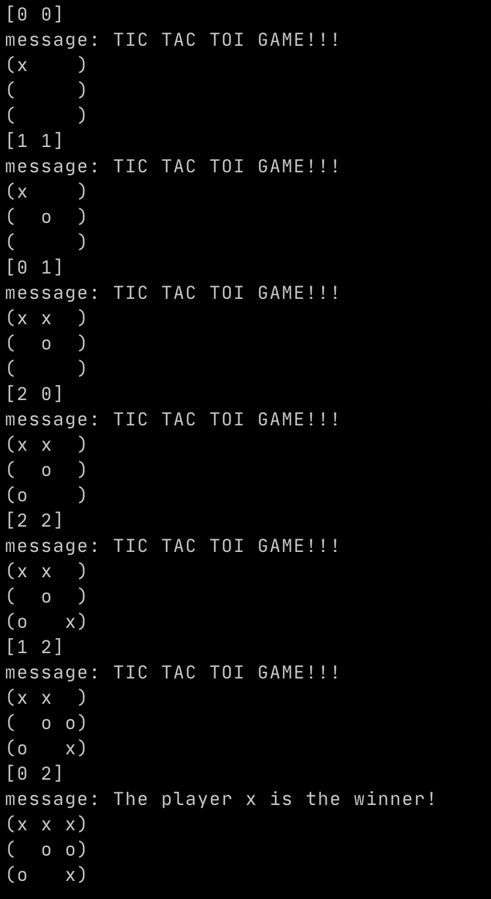

# tic-tac-toe 

Sample tic tac toe game made using clojure. :video_game:

Note: don't expect much from this game. :stuck_out_tongue_winking_eye:

## Installation

Just clone this repository and run the command bellow.

```sh
lein uberjar
```

## Usage

To play this game just run:

    $ java -jar tic-tac-toe-0.1.0-SNAPSHOT-standalone.jar

## How to play

| Options    | Meaning                                    |
| -----------| -------------------------------------------|
| `[x y]`    | to select which position you want to fill. |
| `:restart` | to restart the game.                       |
| `:exit`    | to go out from the game.                   |


## Examples



## License

Copyright 2020 Weverson Nascimento.

Licensed under the Apache License, Version 2.0 (the "License");
you may not use this file except in compliance with the License.
You may obtain a copy of the License at

    http://www.apache.org/licenses/LICENSE-2.0

Unless required by applicable law or agreed to in writing, software
distributed under the License is distributed on an "AS IS" BASIS,
WITHOUT WARRANTIES OR CONDITIONS OF ANY KIND, either express or implied.
See the License for the specific language governing permissions and
limitations under the License.
